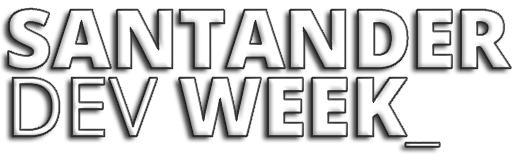
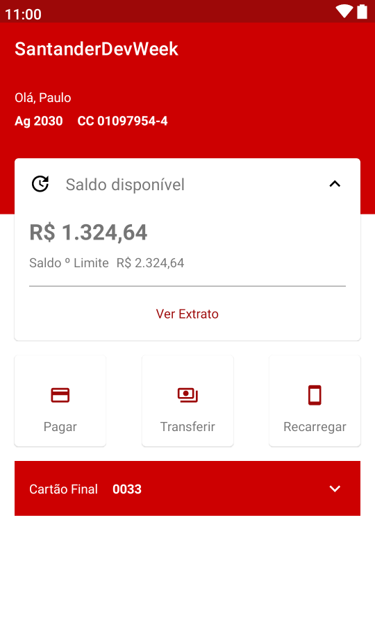
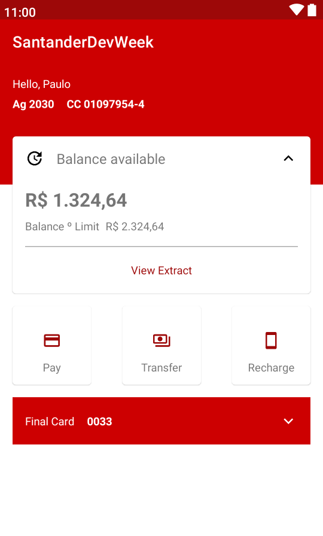

 

A SantanderDevWeek, foi uma semana imersiva em que aborda assuntos sobre Full-Stack e Mobile, tecnologias como Java, Angular (Full-Stack) e Kotlin (Mobile), Mentorias diárias com profissionais do Santander e da DIO, contando como desenvolver sua carreira e a cultura empregada no Santander.

## Sobre o Projeto

Foi proposto durante essa semana de desenvolvimento a recriação do layout do aplicativo do Banco Santander! Usando a metodologia MVVM, conceitos de Material Design, Integração com o Firebase e Internacionalização.

## Preview :framed_picture:

## Technologies :microscope:

## License 📝

This project is licensed under the MIT License. See the [LICENSE](https://github.com/pauloeduardo2906/SantanderDevWeek/blob/main/LICENSE "LICENSE") file for details.

 

**
Made by Paulo Eduardo Jr. with ​❤ Enjoy it!
**
